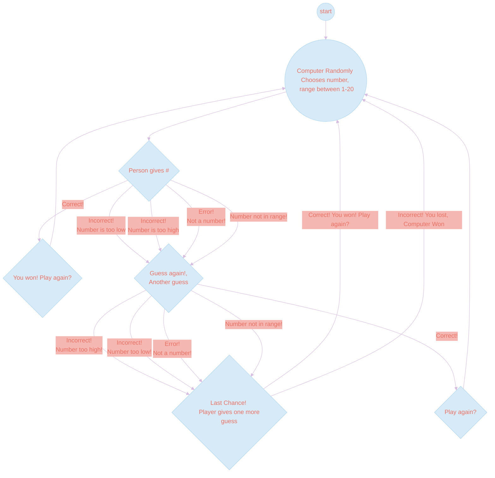

# Guessing Gaming

The flow chart describes the three tries the player gets to guess the correct number. The computer randomly picks a number between 1 and 20. The player then has 3 tries to guess the number chosen by the computer. 

If a number is lower than the chosen number, it will display "Incorrect! Number is too low!". If the number is higher than the chosen number it will display, "Incorrect!, Number is too high!". If the player inputs anything other than a number, it will display "Error! Not a number!". 

Finally, if the player inputs the correct number, the game will loop back to the start where a new number will be chosen by the computer. 
